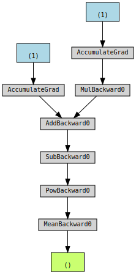

참고 블로그
============================
이 글은 다음 블로그를 참고해서 작성되었습니다.

Understanding PyTorch with an example: a step-by-step tutorial, by Daniel Godoy, May 7, 2019
https://towardsdatascience.com/understanding-pytorch-with-an-example-a-step-by-step-tutorial-81fc5f8c4e8e

문제 : y = 1 + 2x에 의도적으로 약간의 노이즈를 더 한 점 (x, y)의 Dataset을 만들었다. y = a + bx라는 함수원형에서 선형회귀 방식으로 Dataset에 가장 잘 매칭되는 값 a, b를 구하려 한다.


먼저, Numpy 이용해서 선형회귀를 직접 구현해 보고, sklearn에서 제공하는 함수로 값을 구해서 두 개를 비교해 볼 것이다. 그리고 PyTorch를 이용해서 같은 선형회귀 함수를 구현해 본 뒤에, Optimizer, Loss 함수, Model, Dataset, DataLoader 개념을 하나씩 적용해 보면서 코드가 어떻게 더 간단하게 바뀌는지 확인해 보자.


# 준비 : Dataset 생성


```python
import numpy as np

# Data Generation
np.random.seed(42)
x = np.random.rand(100, 1)
y = 1 + 2 * x + .1 * np.random.randn(100, 1)

# Shuffles the indices
idx = np.arange(100)
np.random.shuffle(idx)

# Uses first 80 random indices for train
train_idx = idx[:80]
# Uses the remaining indices for validation
val_idx = idx[80:]

# Generates train and validation sets
x_train, y_train = x[train_idx], y[train_idx]
x_val, y_val = x[val_idx], y[val_idx]
```


```python
import matplotlib.pyplot as plt

plt.figure(figsize=(10,5))
plt.subplot(1,2,1)
plt.xlabel('x_train')
plt.ylabel('y_train')
plt.scatter(x_train,y_train)

plt.subplot(1,2,2)
plt.xlabel('x_val')
plt.ylabel('y_val')
plt.scatter(x_val, y_val)
plt.show()
```


    

    


# Case 1. Numpy를 이용해서 선형회귀 직접 구현하기

## 경사하강법을 이용한 선형회귀 구현


```python
# Initializes parameters "a" and "b" randomly
np.random.seed(42)
a = np.random.randn(1)
b = np.random.randn(1)

# Sets learning rate
lr = 1e-1
# Defines number of epochs
n_epochs = 1000

for epoch in range(n_epochs):
    # Computes our model's predicted output
    yhat = a + b * x_train
    
    # How wrong is our model? That's the error! 
    error = (y_train - yhat)
    # It is a regression, so it computes mean squared error (MSE)
    loss = (error ** 2).mean()
    
    # Computes gradients for both "a" and "b" parameters
    a_grad = -2 * error.mean()
    b_grad = -2 * (x_train * error).mean()
    
    # Updates parameters using gradients and the learning rate
    a = a - lr * a_grad
    b = b - lr * b_grad
    
print(a, b)
```

    [1.02354094] [1.96896411]
    

# Case 2. sklearn 선형회귀 함수 사용


```python
# Sanity Check: do we get the same results as our gradient descent?
from sklearn.linear_model import LinearRegression

linr = LinearRegression()
linr.fit(x_train, y_train)
print(linr.intercept_, linr.coef_[0])
```

    [1.02354075] [1.96896447]
    

#Case 3. PyTorch를 이용해서 선형회귀 구현하기

## Numpy 배열을 PyTorch tensor로 변환


```python
import torch
import torch.optim as optim
import torch.nn as nn

device = 'cuda' if torch.cuda.is_available() else 'cpu'

# Our data was in Numpy arrays, but we need to transform them into PyTorch's Tensors
# and then we send them to the chosen device
x_train_tensor = torch.from_numpy(x_train).float().to(device)
y_train_tensor = torch.from_numpy(y_train).float().to(device)

# Here we can see the difference - notice that .type() is more useful
# since it also tells us WHERE the tensor is (device)
print(type(x_train), type(x_train_tensor), x_train_tensor.type())
```

    <class 'numpy.ndarray'> <class 'torch.Tensor'> torch.cuda.FloatTensor
    

## 계수 a, b 만들기(GPU tensor로)


```python
# We can specify the device at the moment of creation - RECOMMENDED!
torch.manual_seed(42)
a = torch.randn(1, requires_grad=True, dtype=torch.float, device=device)
b = torch.randn(1, requires_grad=True, dtype=torch.float, device=device)
print(a, b)
```

    tensor([0.1940], device='cuda:0', requires_grad=True) tensor([0.1391], device='cuda:0', requires_grad=True)
    

## Autograd로 gradients를 구하고 계수 a, b 업데이트하기


```python
lr = 1e-1
n_epochs = 1000

for epoch in range(n_epochs):
    yhat = a + b * x_train_tensor
    error = y_train_tensor - yhat

    loss = (error ** 2).mean()

    # No more manual computation of gradients! 
    # a_grad = -2 * error.mean()
    # b_grad = -2 * (x_tensor * error).mean()
    
    # We just tell PyTorch to work its way BACKWARDS from the specified loss!
    loss.backward()
    # Let's check the computed gradients...
    # print(a.grad, b.grad)
    
    # What about UPDATING the parameters? Not so fast...
    
    # FIRST ATTEMPT
    # AttributeError: 'NoneType' object has no attribute 'zero_'
    # a = a - lr * a.grad
    # b = b - lr * b.grad
    # print(a)

    # SECOND ATTEMPT
    # RuntimeError: a leaf Variable that requires grad has been used in an in-place operation.
    # a -= lr * a.grad
    # b -= lr * b.grad        
    
    # THIRD ATTEMPT
    # We need to use NO_GRAD to keep the update out of the gradient computation
    # Why is that? It boils down to the DYNAMIC GRAPH that PyTorch uses...
    with torch.no_grad():
        a -= lr * a.grad
        b -= lr * b.grad

    # PyTorch is "clingy" to its computed gradients, we need to tell it to let it go...
    a.grad.zero_()
    b.grad.zero_()
    
print(a, b)
```

    tensor([1.0235], device='cuda:0', requires_grad=True) tensor([1.9690], device='cuda:0', requires_grad=True)
    

## Computation graph 확인하기


```python
!pip install torchviz

from torchviz import make_dot

torch.manual_seed(42)
a = torch.randn(1, requires_grad=True, dtype=torch.float, device=device)
b = torch.randn(1, requires_grad=True, dtype=torch.float, device=device)

yhat = a + b * x_train_tensor
error = y_train_tensor - yhat
loss = (error ** 2).mean()

make_dot(loss)
```

    Requirement already satisfied: torchviz in /usr/local/lib/python3.7/dist-packages (0.0.2)
    Requirement already satisfied: torch in /usr/local/lib/python3.7/dist-packages (from torchviz) (1.10.0+cu111)
    Requirement already satisfied: graphviz in /usr/local/lib/python3.7/dist-packages (from torchviz) (0.10.1)
    Requirement already satisfied: typing-extensions in /usr/local/lib/python3.7/dist-packages (from torch->torchviz) (3.10.0.2)
    


    

    


## Optimizer
주의 : Optimizer의 이름은 SGD(Stochastic Gradient Descent)이나, 실제 코드는 Batch Gradient Descent(모든 트레이닝 데이터셋를 돌려서 1번의 업데이트)로 구현되어 있다.


```python
torch.manual_seed(42)
a = torch.randn(1, requires_grad=True, dtype=torch.float, device=device)
b = torch.randn(1, requires_grad=True, dtype=torch.float, device=device)
print(a, b)

lr = 1e-1
n_epochs = 1000

# Defines a SGD optimizer to update the parameters
optimizer = optim.SGD([a, b], lr=lr)

for epoch in range(n_epochs):
    yhat = a + b * x_train_tensor
    error = y_train_tensor - yhat
    loss = (error ** 2).mean()

    loss.backward()    
    
    # No more manual update!
    # with torch.no_grad():
    #     a -= lr * a.grad
    #     b -= lr * b.grad
    optimizer.step()
    
    # No more telling PyTorch to let gradients go!
    # a.grad.zero_()
    # b.grad.zero_()
    optimizer.zero_grad()
    
print(a, b)
```

    tensor([0.1940], device='cuda:0', requires_grad=True) tensor([0.1391], device='cuda:0', requires_grad=True)
    tensor([1.0235], device='cuda:0', requires_grad=True) tensor([1.9690], device='cuda:0', requires_grad=True)
    

##Loss 함수
주의 : nn.MSELoss함수는 Loss함수를 생성해 주는 것이지 Loss함수 그 자체가 아니다.


```python
torch.manual_seed(42)
a = torch.randn(1, requires_grad=True, dtype=torch.float, device=device)
b = torch.randn(1, requires_grad=True, dtype=torch.float, device=device)
print(a, b)

lr = 1e-1
n_epochs = 1000

# Defines a MSE loss function
loss_fn = nn.MSELoss(reduction='mean')

optimizer = optim.SGD([a, b], lr=lr)

for epoch in range(n_epochs):
    yhat = a + b * x_train_tensor
    
    # No more manual loss!
    # error = y_tensor - yhat
    # loss = (error ** 2).mean()
    loss = loss_fn(y_train_tensor, yhat)

    loss.backward()    
    optimizer.step()
    optimizer.zero_grad()
    
print(a, b)
```

    tensor([0.1940], device='cuda:0', requires_grad=True) tensor([0.1391], device='cuda:0', requires_grad=True)
    tensor([1.0235], device='cuda:0', requires_grad=True) tensor([1.9690], device='cuda:0', requires_grad=True)
    

## 모델을 정의해서 사용해 보자

###모델을 직접 구현
파이토치에서 모델은 nn.Module 클래스를 상속받는 형태로 표현된다. 이때는 아래 2가지 함수를 구현해야 한다.
* \_\_init\_\_(self) : 클래스 생성자 함수로서 모델의 속성을 정의. 꼭 매개변수에 한정되는 것이 아니고, 다른 모델(또는 레이어들)을 속성으로 가질 수도 있다.
* forward(self, x) : 실제 연산식을 정의. 직접 호출할 일은 없다(train/eval 시는 대신 model(x)로 호출)

아래 예제에서 init 함수 안에서는 nn.Parameter 클래스를 이용해서 매개변수 a, b를 정의하고 있는데, 이로써 파이토치에 이 텐서들이 모델의 매개변수라고 알려주게 된다. 이러면 나중에 사용할 때 여러가지 장점이 있다.


```python
class ManualLinearRegression(nn.Module):
    def __init__(self):
        super().__init__()
        # To make "a" and "b" real parameters of the model, we need to wrap them with nn.Parameter
        self.a = nn.Parameter(torch.randn(1, requires_grad=True, dtype=torch.float))
        self.b = nn.Parameter(torch.randn(1, requires_grad=True, dtype=torch.float))
        
    def forward(self, x):
        # Computes the outputs / predictions
        return self.a + self.b * x
```


```python
torch.manual_seed(42)

# Now we can create a model and send it at once to the device
model = ManualLinearRegression().to(device)
# We can also inspect its parameters using its state_dict
print(model.state_dict())

lr = 1e-1
n_epochs = 1000

loss_fn = nn.MSELoss(reduction='mean')
optimizer = optim.SGD(model.parameters(), lr=lr)

for epoch in range(n_epochs):
    # 모델을 Train 모드로 설정(반대는 model.eval())
    model.train()

    # No more manual prediction!
    # yhat = a + b * x_tensor
    yhat = model(x_train_tensor)
    
    loss = loss_fn(y_train_tensor, yhat)
    loss.backward()    
    optimizer.step()
    optimizer.zero_grad()
    
print(model.state_dict())
```

    OrderedDict([('a', tensor([0.3367], device='cuda:0')), ('b', tensor([0.1288], device='cuda:0'))])
    OrderedDict([('a', tensor([1.0235], device='cuda:0')), ('b', tensor([1.9690], device='cuda:0'))])
    

### Nested 모델 사용
Nested 모델이란, 다른 모델을 포함하는 모델을 말한다. Pytorch에서 제공하는 Linear 모델을 속성으로 포함하는 모델을 생성해 보자.


```python
class LayerLinearRegression(nn.Module):
    def __init__(self):
        super().__init__()
        # Instead of our custom parameters, we use a Linear layer with single input and single output
        self.linear = nn.Linear(1, 1)
                
    def forward(self, x):
        # Now it only takes a call to the layer to make predictions
        return self.linear(x)
```


```python
torch.manual_seed(42)

model = LayerLinearRegression().to(device)
print(model.state_dict())

lr = 1e-1
n_epochs = 1000

loss_fn = nn.MSELoss(reduction='mean')
optimizer = optim.SGD(model.parameters(), lr=lr)

for epoch in range(n_epochs):
    model.train()
    yhat = model(x_train_tensor)
    
    loss = loss_fn(y_train_tensor, yhat)
    loss.backward()    
    optimizer.step()
    optimizer.zero_grad()
    
print(model.state_dict())
```

    OrderedDict([('linear.weight', tensor([[0.7645]], device='cuda:0')), ('linear.bias', tensor([0.8300], device='cuda:0'))])
    OrderedDict([('linear.weight', tensor([[1.9690]], device='cuda:0')), ('linear.bias', tensor([1.0235], device='cuda:0'))])
    

### Sequential 모델 사용
Linear 같이 사전에 정의된 레이어를 조합해서 출력을 그대로 다음 레이어의 입력으로 사용하는 경우, 별도로 모델을 정의하지 않고 Sequential 모델을 사용해도 된다.


```python
torch.manual_seed(42)

# Alternatively, you can use a Sequential model
model = nn.Sequential(nn.Linear(1, 1)).to(device)
print(model.state_dict())

lr = 1e-1
n_epochs = 1000

loss_fn = nn.MSELoss(reduction='mean')
optimizer = optim.SGD(model.parameters(), lr=lr)

for epoch in range(n_epochs):
    model.train()
    yhat = model(x_train_tensor)
    
    loss = loss_fn(y_train_tensor, yhat)
    loss.backward()    
    optimizer.step()
    optimizer.zero_grad()
    
print(model.state_dict())
```

    OrderedDict([('0.weight', tensor([[0.7645]], device='cuda:0')), ('0.bias', tensor([0.8300], device='cuda:0'))])
    OrderedDict([('0.weight', tensor([[1.9690]], device='cuda:0')), ('0.bias', tensor([1.0235], device='cuda:0'))])
    

## Train step 함수를 만들어서 for loop 안을 짧게 정리
model, loss 함수, optimizer가 바뀔 뿐, 아래의 코드는 공통적이다.


```python
def make_train_step(model, loss_fn, optimizer):
    # Builds function that performs a step in the train loop
    def train_step(x, y):
        # Sets model to TRAIN mode
        model.train()
        # Makes predictions
        yhat = model(x)
        # Computes loss
        loss = loss_fn(y, yhat)
        # Computes gradients
        loss.backward()
        # Updates parameters and zeroes gradients
        optimizer.step()
        optimizer.zero_grad()
        # Returns the loss
        return loss.item()
    
    # Returns the function that will be called inside the train loop
    return train_step

# Creates the train_step function for our model, loss function and optimizer
train_step = make_train_step(model, loss_fn, optimizer)
losses = []

# For each epoch...
for epoch in range(n_epochs):
    # Performs one train step and returns the corresponding loss
    loss = train_step(x_train_tensor, y_train_tensor)
    losses.append(loss)
    
# Checks model's parameters
print(model.state_dict())
```

    OrderedDict([('0.weight', tensor([[1.9690]], device='cuda:0')), ('0.bias', tensor([1.0235], device='cuda:0'))])
    

## Dataset을 사용해 보자
Dataset은 뒤에 소개하는 DataLoader를 사용하기 위해 사용한다. 파이토치에서 Dataset은 utils.data.Dataset 클래스를 상속받는 형태로 표현된다. 기본적으로는 tuple의 리스트라고 보면 된다. 모든 데이터를 미리 로드해서 가지고 있을 수도 있고, 필요 시(\_\_getitem\_\_함수가 호출될 때)에만 조금씩 불러와도 된다.


아래 예제에서는 CPU tensor로 생성하고 있는데, 이는 GPU tensor로 생성하게 되면 그만큼 GPU의 RAM을 점유하고 있게 되기 때문이다.


```python
from torch.utils.data import Dataset

class CustomDataset(Dataset):
    def __init__(self, x_tensor, y_tensor):
        self.x = x_tensor
        self.y = y_tensor
        
    def __getitem__(self, index):
        return (self.x[index], self.y[index])

    def __len__(self):
        return len(self.x)

# Wait, is this a CPU tensor now? Why? Where is .to(device)?
x_train_tensor = torch.from_numpy(x_train).float()
y_train_tensor = torch.from_numpy(y_train).float()

train_data = CustomDataset(x_train_tensor, y_train_tensor)
print(train_data[0])
```

    (tensor([0.7713]), tensor([2.4745]))
    

Dataset이 텐서만으로 이루어져 있다면, 커스텀 클래스를 만들 필요없이 그냥 TensorDataset 클래스를 바로 사용하면 된다.


```python
from torch.utils.data import TensorDataset

x_train_tensor = torch.from_numpy(x_train).float()
y_train_tensor = torch.from_numpy(y_train).float()

train_data = TensorDataset(x_train_tensor, y_train_tensor)
print(train_data[0])
```

    (tensor([0.7713]), tensor([2.4745]))
    

## DataLoader 사용하기
데이터의 양이 많아지게 되면, 이때는 mini-batch 경사하강법을 사용해야 한다. 이 경우 DataLoader 클래스를 사용하면 훨씬 편하게 구현할 수 있다.


고용량 데이터셋을 다룰 때 GPU의 RAM을 가장 효과적으로 사용하려면, Dataset의 \_\_get\_item\_\_함수를 사용해서 CPU tensor로 로딩해 두었다가 하나의 mini-batch에 해당하는 샘플들만 한번에 GPU tensor로 변환해서 집어넣어 넣는 것이 좋다.


```python
from torch.utils.data import DataLoader

train_loader = DataLoader(dataset=train_data, batch_size=16, shuffle=True)

losses = []
train_step = make_train_step(model, loss_fn, optimizer)

for epoch in range(n_epochs):
    for x_batch, y_batch in train_loader:
        # the dataset "lives" in the CPU, so do our mini-batches
        # therefore, we need to send those mini-batches to the
        # device where the model "lives"
        x_batch = x_batch.to(device)
        y_batch = y_batch.to(device)
        
        loss = train_step(x_batch, y_batch)
        losses.append(loss)
        
print(model.state_dict())
```

    OrderedDict([('0.weight', tensor([[1.9696]], device='cuda:0')), ('0.bias', tensor([1.0243], device='cuda:0'))])
    

## random_split 사용하기
원본 데이터를 먼저 Dataset에 넣으면 random_split 함수를 사용해서 편하게 train / validation dataset을 만들 수 있다. 


```python
from torch.utils.data.dataset import random_split

x_tensor = torch.from_numpy(x).float()
y_tensor = torch.from_numpy(y).float()

dataset = TensorDataset(x_tensor, y_tensor)

train_dataset, val_dataset = random_split(dataset, [80, 20])

train_loader = DataLoader(dataset=train_dataset, batch_size=16)
val_loader = DataLoader(dataset=val_dataset, batch_size=20)
```

## Evaluation 사용하기


```python
losses = []
val_losses = []

# Builds a simple sequential model
model = nn.Sequential(nn.Linear(1, 1)).to(device)

train_step = make_train_step(model, loss_fn, optimizer)

for epoch in range(n_epochs):
    for x_batch, y_batch in train_loader:
        x_batch = x_batch.to(device)
        y_batch = y_batch.to(device)

        loss = train_step(x_batch, y_batch)
        losses.append(loss)
        
    with torch.no_grad():
        for x_val, y_val in val_loader:
            x_val = x_val.to(device)
            y_val = y_val.to(device)
            
            model.eval()

            yhat = model(x_val)
            val_loss = loss_fn(y_val, yhat)
            val_losses.append(val_loss.item())

print(model.state_dict())
```

    OrderedDict([('0.weight', tensor([[-0.9977]], device='cuda:0')), ('0.bias', tensor([0.0088], device='cuda:0'))])
    

## 최종코드


```python
import numpy as np
import torch
import torch.optim as optim
import torch.nn as nn
from torch.utils.data import TensorDataset
from torch.utils.data import DataLoader
from torch.utils.data.dataset import random_split
import matplotlib.pyplot as plt

device = 'cuda' if torch.cuda.is_available() else 'cpu'

torch.manual_seed(42)

# Data Generation
np.random.seed(42)
x = np.random.rand(100, 1)
y = 1 + 2 * x + .1 * np.random.randn(100, 1)

x_tensor = torch.from_numpy(x).float()
y_tensor = torch.from_numpy(y).float()

# Builds dataset with ALL data
dataset = TensorDataset(x_tensor, y_tensor)
# Splits randomly into train and validation datasets
train_dataset, val_dataset = random_split(dataset, [80, 20])
# Builds a loader for each dataset to perform mini-batch gradient descent
train_loader = DataLoader(dataset=train_dataset, batch_size=16)
val_loader = DataLoader(dataset=val_dataset, batch_size=20)

# Builds a simple sequential model
model = nn.Sequential(nn.Linear(1, 1)).to(device)
print(model.state_dict())

# Sets hyper-parameters
lr = 1e-1
n_epochs = 150

# Defines loss function and optimizer
loss_fn = nn.MSELoss(reduction='mean')
optimizer = optim.SGD(model.parameters(), lr=lr)

def make_train_step(model, loss_fn, optimizer):
    # Builds function that performs a step in the train loop
    def train_step(x, y):
        # Sets model to TRAIN mode
        model.train()
        # Makes predictions
        yhat = model(x)
        # Computes loss
        loss = loss_fn(y, yhat)
        # Computes gradients
        loss.backward()
        # Updates parameters and zeroes gradients
        optimizer.step()
        optimizer.zero_grad()
        # Returns the loss
        return loss.item()
    
    # Returns the function that will be called inside the train loop
    return train_step

# Creates function to perform train step from model, loss and optimizer
train_step = make_train_step(model, loss_fn, optimizer)

losses = []
val_losses = []

# Training loop
for epoch in range(n_epochs):

    loss_sum = 0
    val_loss_sum = 0

    # Uses loader to fetch one mini-batch for training
    for x_batch, y_batch in train_loader:
        # NOW, sends the mini-batch data to the device
        # so it matches location of the MODEL
        x_batch = x_batch.to(device)
        y_batch = y_batch.to(device)
        # One step of training
        loss = train_step(x_batch, y_batch)
        loss_sum += loss

    losses.append(loss_sum)
        
    # After finishing training steps for all mini-batches,
    # it is time for evaluation!
        
    # We tell PyTorch to NOT use autograd...
    # Do you remember why?
    with torch.no_grad():
        # Uses loader to fetch one mini-batch for validation
        for x_val, y_val in val_loader:
            # Again, sends data to same device as model
            x_val = x_val.to(device)
            y_val = y_val.to(device)
            
            model.eval()
            # Makes predictions
            yhat = model(x_val)
            # Computes validation loss
            val_loss = loss_fn(y_val, yhat)
            # loss는 (1,) shape를 갖는 tensor이기 때문에 item()함수로 Scalar값으로 변경
            val_loss_sum += val_loss.item() 

        val_losses.append(val_loss_sum)

print(model.state_dict())

epochs = np.arange(0,n_epochs)

plt.figure(figsize=(10,5))
plt.subplot(1,2,1)
plt.xlabel('Epoch')
plt.ylabel('Train Loss')
plt.plot(epochs,losses)

plt.subplot(1,2,2)
plt.xlabel('Epoch')
plt.ylabel('Validation Loss')
plt.plot(epochs, val_losses)
plt.show()
```

    OrderedDict([('0.weight', tensor([[-0.9676]])), ('0.bias', tensor([-0.5727]))])
    OrderedDict([('0.weight', tensor([[1.9625]])), ('0.bias', tensor([1.0147]))])
    


    

    

